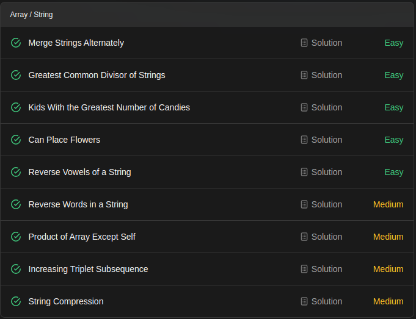

### LeetCode 75 
#### Ace Coding Interview with 75 Qs

# 1071. Greatest Common Divisor of Strings
>For two strings s and t, we say "t divides s" if and only if s = t + t + t + ... + t + t (i.e., t is concatenated with itself one or more times).

>Given two strings str1 and str2, return the largest string x such that x divides both str1 and str2.
## Algorithm
 1. Find the shorter string among **str1** and **str2**, without loss of generality, let it be **str1**.
 2. Start with base = str1, and check if both **str1** and **str2** are made of multiples of base.
 3. If so, return **base**.
 4. Otherwise, we shall try a shorter string by removing the last character from **base**.
 5. If we have checked all prefix strings without finding the GCD string, return **""**.